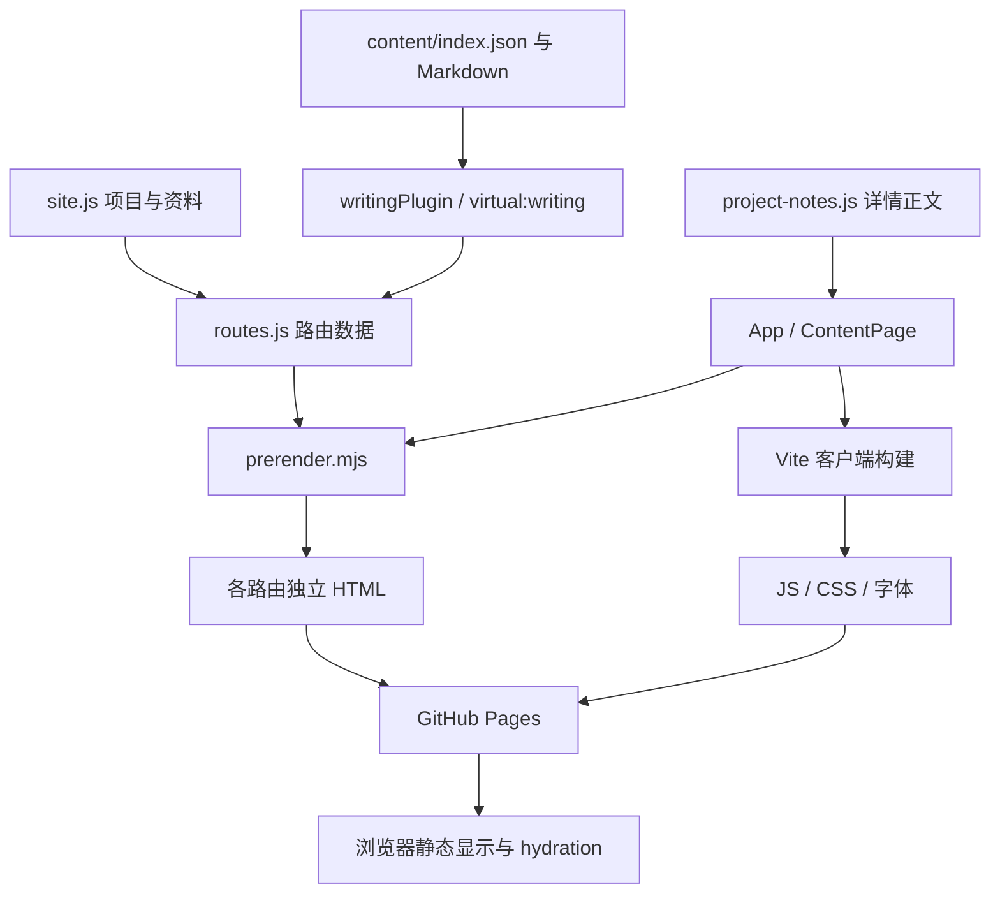

# 开发设计与扩展约定

本文描述当前实现的模块关系与维护约束。使用者入口见 [功能说明](FEATURES.md)，环境与命令见 [本地开发](DEVELOPMENT.md)。路径均相对仓库根目录。

## 1. 架构边界

本站是 React + Vite 的静态多页面网站，使用同一套组件进行构建时预渲染和客户端 hydration。没有应用服务器、数据库或运行时内容 API；内容变更通过 Git 提交和构建发布。GitHub Pages 负责返回静态 HTML、脚本、样式与附件。



每次构建生成完整站点，生产环境不从 GitHub 动态拉取项目介绍。源码仓库中的项目情况改变后，需要人工核对并更新展示文案。

## 2. 数据和页面之间的契约

| 数据入口 | 消费方 | 维护约束 |
| --- | --- | --- |
| `profile` | 首页、导航、页脚 | 可选邮箱为空时隐藏邮件链接 |
| `projects` | 首页、路由、项目页、ProjectPager | ID 稳定且唯一；数组顺序决定列表与翻页顺序 |
| `projectNotes` | ContentPage | 以项目 ID 索引，必须为每个项目提供正文 |
| `extraLinks` | 首页项目区 | 空数组隐藏额外链接板块 |
| `content/index.json` | loadWriting | 仅布尔值 published=true 的条目进入校验和输出 |
| `virtual:writing` | routes.js、ContentPage | 构建生成的模块，不是应手动编辑的文件 |

`projects.details` 是简介弹窗要点；独立页面读取 `projectNotes.implementation`。两者有意分开，避免扩写正文时同时把弹窗拉得过长。`projectNotes.scope` 保存多个段落，解释适用范围与验证边界。

内容加载器检查已发布文章和论文的类型、路径、日期、重复路由及材料存在性，但不是通用 schema 校验器。项目 ID、项目与正文映射、文章 project 关联值仍需维护者核对。字段示例见 [内容维护](CONTENT.md)。

## 3. 路由、预渲染与启动顺序

`src/data/routes.js` 导出 `routes`、`href()`、`currentPath()`。页面通过 `App` 的 path 属性选择首页或 `ContentPage`，使用原生链接跨文档导航，没有客户端路由库。`currentPath()` 去除部署前缀、规范化尾斜杠和 index.html；新增路由时仍需在页面分支和路由清单中同时提供实现。

启动过程分为三层：

1. **head 脚本**：`index.html` 提前读取主题；Vite 插件内联首页入口与过渡保护脚本，使它们不依赖应用包下载。
2. **静态正文**：`prerender.mjs` 将 App 输出写入各路由的 index.html，普通访问可先显示正文。
3. **客户端**：`main.jsx` 依据 pathname 创建相同页面。有预渲染内容则 hydrateRoot，否则 createRoot；随后接入 effect、事件和样式增强标记。

`App` 的首次状态应与服务端输出一致。本地偏好在 hydration 后读取、保存，避免服务端渲染依赖浏览器存储。新增组件不要在渲染阶段直接访问 window、document 或剪贴板，也不要让正文是否可见取决于动画是否执行完毕。

### 页面元信息

预渲染为各路由替换 title 和 description，非首页移除首屏图片预加载。Open Graph 标题与描述目前仍来自 `index.html` 的固定站点值，不是逐页生成的分享卡片。若增加分享图、canonical 或 sitemap，应单独扩展构建输出并验证，不能只改页面可见标题。

## 4. 状态归属与组件职责

| 模块 | 拥有的状态或职责 | 不应承担的职责 |
| --- | --- | --- |
| App | 主题、拖尾、喜欢、菜单、当前板块、弹窗与提示 | 读取远程项目数据或实现内容后台 |
| useProjectFilter | 当前分类、列表引用、动画取消与替换 | 改写详情路由、持久化分类 |
| ContentPage | 按 path 展示项目、索引、正文或 404 | 修改项目数据或写入发布文件 |
| Modal | 原生 dialog、背景滚动锁定、焦点恢复 | 控制页面路由 |
| PageNavigation / ScrollToTop | 滚动方向、可见性、键盘焦点与入口互斥 | 接管滚轮速度或劫持历史 |
| ProjectPager | 按完整项目数组计算前后页 | 按首页筛选动态改写翻页顺序 |
| AnimatedCursor | 角色位置、上下文、短暂反馈和顶层展示 | 拦截业务点击或代替成功判断 |
| PointerSurfaces | 命中检测、倾转、光晕与波纹清理 | 保存偏好或修改内容 |
| PetalTrail | 装饰画布与鼠标拖尾 | 承担输入区域或影响布局 |

持久化键与默认值见功能说明。所有浏览器 effect 应在卸载时取消动画帧、计时器、监听和观察器。客户端使用 StrictMode，开发中 effect 可能重复挂载，新增逻辑不能依赖“只执行一次且永不清理”的假设。

## 5. 组件之间的事件约定

业务操作使用 document 上的 `cursor-feedback` CustomEvent 通知角色组件：

| detail | 发送位置 | 发送条件 |
| --- | --- | --- |
| `like` | App 的喜欢按钮 | 从未喜欢变为喜欢 |
| `copied` | App 的复制链接操作 | 剪贴板写入成功之后 |
| `filtered` | useProjectFilter | 新类别已同步更新之后 |

角色组件只在可见且允许动态效果时响应事件。业务逻辑不等待角色动画完成；角色不可用时，按钮、内容变化和文字提示仍然有效。

```javascript
// 先完成操作，再通知装饰性反馈；不要用该事件执行实际业务。
document.dispatchEvent(new CustomEvent('cursor-feedback', { detail: 'copied' }));
```

`data-cursor` 用于声明阅读、下载、复制等上下文，`AnimatedCursor` 另有允许值集合。新增一个字符串不会自动拥有完整行为，需同时核对上下文识别、反馈文案、样式和测试。`data-pointer-inside` 由表面组件管理，不应作为永久写入 JSX 的属性。

## 6. 样式与动态效果分层

样式按 `main.jsx` 导入顺序加载：base → motion → pointer → content → navigation → avatar → chapters。后加载规则可能覆盖前面的属性，因此排查时应检查浏览器最终计算样式，而不是只搜索第一个同名选择器。

| 样式文件 | 主要职责 |
| --- | --- |
| base.css | 主题变量、基础布局、导航、卡片、弹窗、断点 |
| motion.css | 通用动效、项目滚动翻转、项目区 sticky |
| pointer.css | 指针反馈、表面倾转与粒子样式 |
| content.css | 索引、项目详情、Markdown 与阅读交互 |
| navigation.css | 页面过渡、返回入口和项目翻页 |
| avatar.css | 头像构图与问候反馈 |
| chapters.css | 首屏及章节滚动编排 |

颜色优先使用 `--bg`、`--surface`、`--ink`、`--muted`、`--accent` 和 `--line` 等主题变量。角色素材与指尖热点维持一致；业务内容的字号、链接对比度和点击范围不应随角色动画缩小。动效细节及可调位置见 [交互实现](MOTION.md)。

## 7. 常见扩展的修改清单

### 增加一个内容页面类型

需要同时修改内容加载器的 type 规则、routes 路由、ContentPage 的标题和渲染分支、导航或入口，以及文档与测试。当前仅支持 articles/papers，在 JSON 中填写新的 type 会被拒绝。还需明确该类型是否需要 Markdown、附件或外部链接。

### 增加一个独立功能页面

为 App/ContentPage 提供可预渲染分支，在 routes 注册标题和描述，通过 href() 生成入口。构建后检查该目录 index.html 是否生成、能否直接访问和刷新、无 JS 时是否可阅读。不要只做一个客户端点击后才存在的视图并假设 Pages 可以处理其地址。

### 增加偏好设置

明确默认值和存储键，在初始化读取失败时使用可用默认值；避免 hydration 前用不一致状态替换正文。只在已读入偏好后保存，防止初始默认值覆盖旧设置。补充功能说明、存储键表及刷新后恢复的检查。

### 接入动态服务

GitHub Pages 只能提供本站静态产物。评论、在线上传、认证或跨设备收藏需要另行选择服务端和数据持久化方案，并明确请求失败、权限和数据公开范围。不要将模型或服务密钥写入前端源码、public 文件或客户端可见环境变量。

## 8. 验证边界

本项目浏览器测试覆盖既定页面和关键交互，不代表所有浏览器组合均已验证。CI 当前执行内容加载/渲染测试及生产构建，不自动执行整套 Edge 回归。项目扩展、路由变化或新增动作应按实际影响更新相应测试，而不是仅让旧测试继续通过。

交付一次修改时，记录改动功能、受影响文件、运行过的检查及未验证条件。日常流程、命令与报告位置见开发指南；发布与回退见部署说明。
